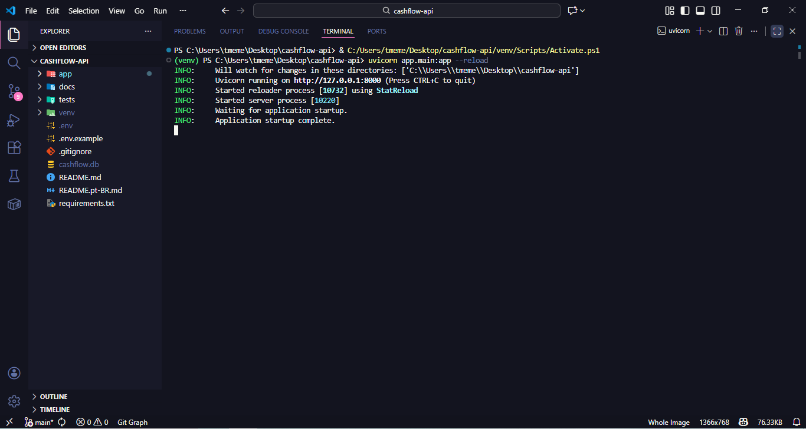
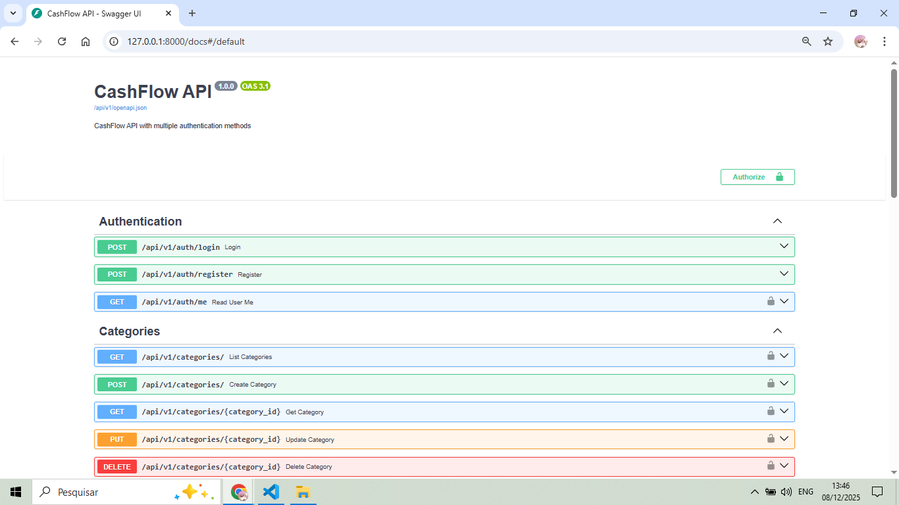
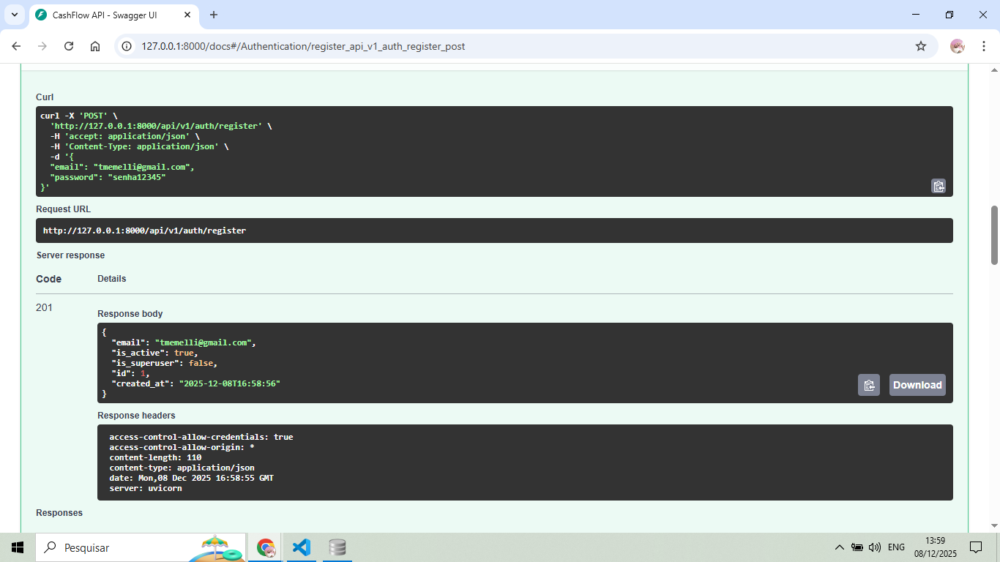
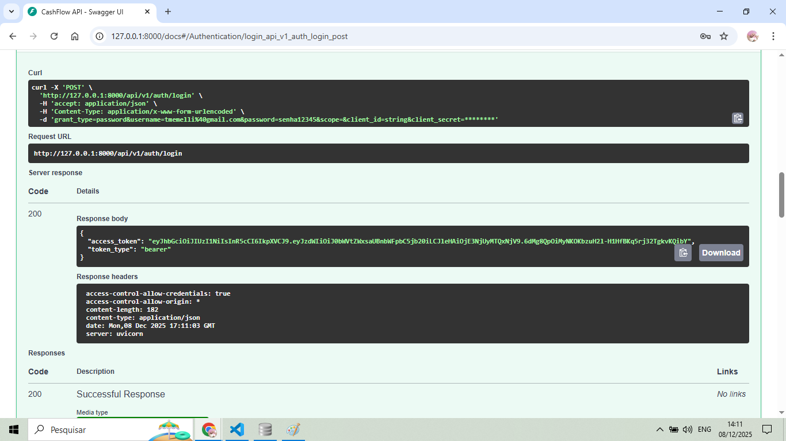
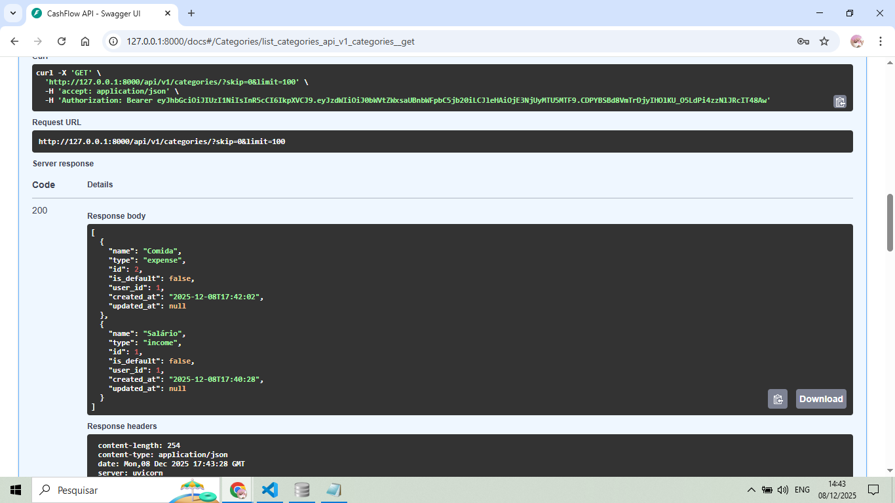
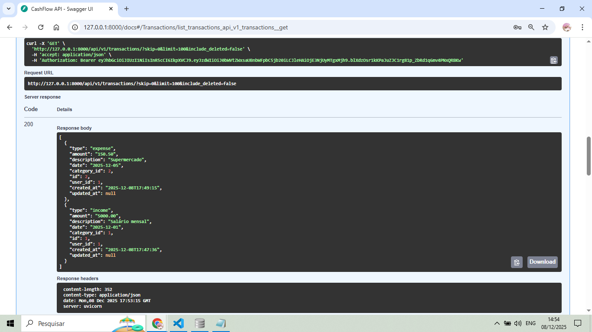
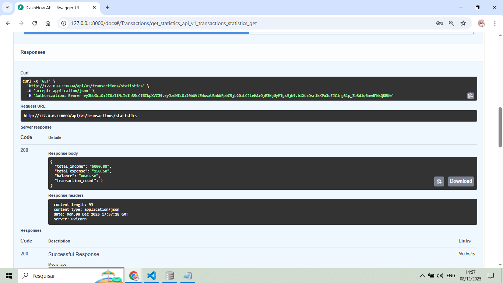
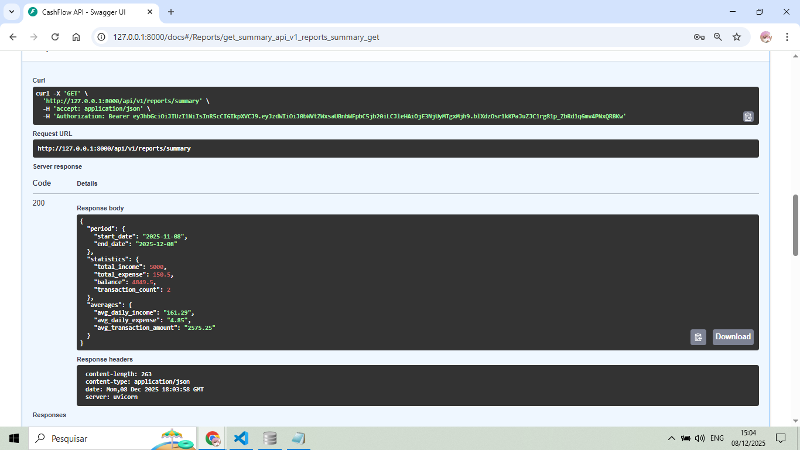
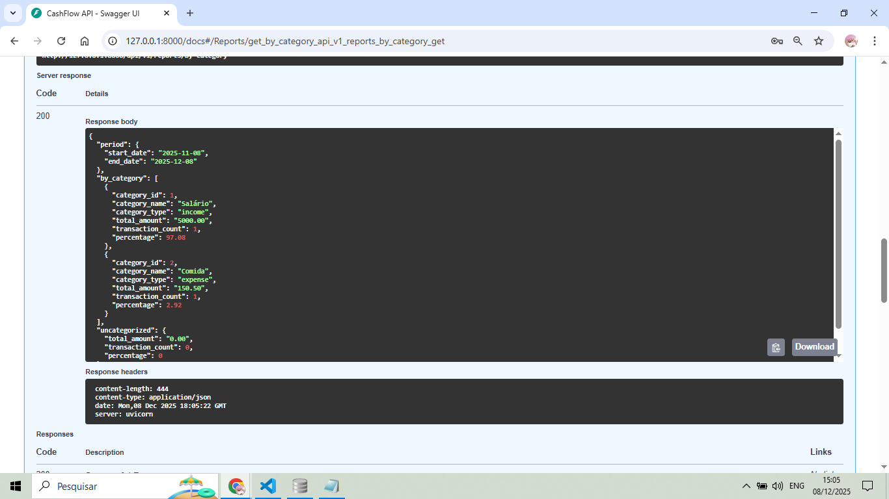
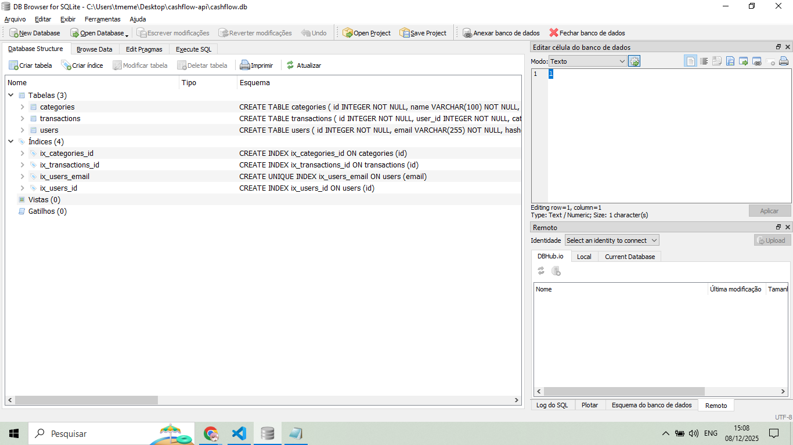

# 💰 CashFlow API

<div align="center">

🌍 **Language / Idioma**

[🇺🇸 English](./README.md) | 🇧🇷 **Português**

</div>

---


Uma API RESTful profissional para gestão financeira pessoal, construída com tecnologias modernas Python e melhores práticas.

**Autor:** Thiago Memelli  
**Primeiro Projeto de API em Python** - Demonstrando arquitetura limpa, práticas de segurança e testes abrangentes.

---

## 📋 Índice

- [Visão Geral](#-visão-geral)
- [Funcionalidades](#-funcionalidades)
- [Tecnologias](#-tecnologias)
- [Arquitetura](#-arquitetura)
- [Instalação](#-instalação)
- [Uso](#-uso)
- [Documentação da API](#-documentação-da-api)
- [Screenshots](#-screenshots)
- [Estrutura do Projeto](#-estrutura-do-projeto)
- [Melhorias Futuras](#-melhorias-futuras)
- [Autor](#-autor)

---

## 🎯 Visão Geral

CashFlow API é um sistema completo de gestão financeira que permite aos usuários:
- Rastrear receitas e despesas com categorização detalhada
- Gerar relatórios e estatísticas financeiras abrangentes
- Analisar padrões de gastos por categoria
- Monitorar tendências financeiras mensais
- Manter autenticação segura de usuários com tokens JWT

Este projeto demonstra **código pronto para produção** com:
- ✅ Arquitetura Limpa (separação de responsabilidades)
- ✅ Princípios de design de API RESTful
- ✅ Validação abrangente de entrada
- ✅ Autenticação e autorização baseada em JWT
- ✅ Padrão de exclusão suave (preservação de dados)
- ✅ Documentação detalhada da API (OpenAPI/Swagger)
- ✅ Segurança de tipos com schemas Pydantic

---

## ✨ Funcionalidades

### 🔐 Autenticação & Segurança
- **Autenticação por Token JWT** - Acesso seguro a endpoints protegidos
- **Hash de Senhas** - Criptografia Bcrypt para senhas de usuários
- **Expiração de Token** - Timeout de sessão configurável
- **Autorização de Usuário** - Controle de permissões em nível de endpoint

### 📊 Gestão Financeira
- **Tipos Duplos de Transação** - Rastreamento de Receitas e Despesas
- **Sistema de Categorias** - Organize transações por categorias personalizadas ou padrão
- **Exclusão Suave** - Transações são marcadas como excluídas, não removidas permanentemente (trilha de auditoria)
- **Filtragem por Intervalo de Datas** - Consulte transações por períodos específicos

### 📈 Análises & Relatórios
- **Estatísticas Financeiras** - Cálculo em tempo real de totais, saldo e contagem de transações
- **Relatórios de Resumo** - Médias diárias de receitas, despesas e transações
- **Detalhamento por Categoria** - Análise de gastos/receitas por categoria com percentuais
- **Tendências Mensais** - Dados financeiros históricos agrupados por mês
- **Análise de Tendências** - Opções de agregação diária, semanal ou mensal

### 🛡️ Integridade de Dados
- **Camada de Validação** - Schemas Pydantic garantem correção dos dados
- **Segurança de Tipos** - Enums para tipos de transação e categoria
- **Restrições de Chave Estrangeira** - Integridade referencial no banco de dados
- **Timestamps Automáticos** - Rastreie tempos de criação e atualização

---

## 🛠️ Tecnologias

| Tecnologia | Versão | Propósito |
|------------|---------|-----------|
| **Python** | 3.11+ | Linguagem de programação principal |
| **FastAPI** | 0.123.7 | Framework web assíncrono moderno |
| **SQLAlchemy** | 2.0.44 | ORM para operações de banco de dados |
| **Pydantic** | 2.12.5 | Validação de dados e configurações |
| **JWT (python-jose)** | 3.5.0 | Autenticação baseada em token |
| **Bcrypt** | 4.0.1 | Hash de senhas |
| **Uvicorn** | 0.38.0 | Servidor ASGI |
| **SQLite** | 3 | Banco de dados leve (desenvolvimento) |

### Por Que Essas Tecnologias?

- **FastAPI**: Documentação automática da API, alto desempenho, suporte async
- **SQLAlchemy**: ORM agnóstico de banco de dados, suporta migração para PostgreSQL
- **Pydantic**: Verificação de tipo em tempo de execução, validação automática
- **JWT**: Autenticação sem estado, escalável para sistemas distribuídos

---

## 🏗️ Arquitetura

### Padrão de Arquitetura Limpa

```
app/
├── api/                    # Camada de API (Controllers)
│   ├── deps.py            # Injeção de dependência
│   └── v1/
│       ├── api.py         # Agregação de rotas
│       └── endpoints/     # Manipuladores de rotas
├── core/                  # Configuração Central
│   ├── config.py         # Gerenciamento de configurações
│   └── security.py       # Utilitários de autenticação
├── crud/                  # Camada de Acesso a Dados
│   ├── base.py           # Operações CRUD genéricas
│   └── crud_*.py         # Operações específicas do modelo
├── db/                    # Camada de Banco de Dados
│   ├── base.py           # Registro de modelos
│   └── session.py        # Conexão com BD
├── models/                # Camada de Domínio (Modelos ORM)
│   ├── user.py
│   ├── category.py
│   └── transaction.py
└── schemas/               # Camada de Apresentação (DTOs)
    ├── user.py
    ├── category.py
    └── transaction.py
```

### Padrões de Design Utilizados

1. **Padrão Repository** - Camada CRUD abstrai operações de banco de dados
2. **Injeção de Dependência** - `Depends()` do FastAPI para dependências limpas
3. **Padrão DTO** - Schemas Pydantic separam contratos de API dos modelos
4. **Padrão de Exclusão Suave** - Flag `is_deleted` preserva trilha de auditoria
5. **Classe Base Genérica** - `CRUDBase` com TypeVars para reutilização de código

---

## 📦 Instalação

### Pré-requisitos

- Python 3.11 ou superior
- pip (gerenciador de pacotes Python)
- Ambiente virtual (recomendado)

### Configuração Passo a Passo

1. **Clone o repositório**
```bash
git clone https://github.com/tmemelli/cashflow-api.git
cd cashflow-api
```

2. **Crie um ambiente virtual**
```bash
python -m venv venv
```

3. **Ative o ambiente virtual**

Windows:
```bash
venv\Scripts\activate
```

Linux/Mac:
```bash
source venv/bin/activate
```

4. **Instale as dependências**
```bash
pip install -r requirements.txt
```

5. **Configure as variáveis de ambiente**

Crie um arquivo `.env` no diretório raiz:
```env
# Configurações da Aplicação
PROJECT_NAME=CashFlow API
VERSION=1.0.0
API_V1_STR=/api/v1

# Configurações de Segurança
SECRET_KEY=sua-chave-secreta-aqui-mudar-em-producao
ALGORITHM=HS256
ACCESS_TOKEN_EXPIRE_MINUTES=30

# Configurações do Banco de Dados
DATABASE_URL=sqlite:///./cashflow.db
```

⚠️ **Importante**: Gere uma SECRET_KEY segura para produção:
```bash
python -c "import secrets; print(secrets.token_hex(32))"
```

6. **Inicialize o banco de dados**
```bash
python create_db.py
```

7. **Execute o servidor**
```bash
uvicorn app.main:app --reload
```

8. **Acesse a API**
- API: http://localhost:8000
- Documentação Interativa (Swagger): http://localhost:8000/docs
- Documentação Alternativa (ReDoc): http://localhost:8000/redoc

---

## 🚀 Uso

### Guia de Início Rápido

#### 1️⃣ Registrar um Usuário
```bash
POST /api/v1/auth/register
{
  "email": "usuario@exemplo.com",
  "password": "senhasegura123"
}
```

#### 2️⃣ Fazer Login
```bash
POST /api/v1/auth/login
{
  "username": "usuario@exemplo.com",
  "password": "senhasegura123"
}
```
Resposta:
```json
{
  "access_token": "eyJhbGciOiJIUzI1NiIsInR5cCI6IkpXVCJ9...",
  "token_type": "bearer"
}
```

#### 3️⃣ Usar o Token

Adicione aos cabeçalhos da requisição:
```
Authorization: Bearer <seu-access-token>
```

Ou use o botão "Authorize" no Swagger UI.

#### 4️⃣ Criar uma Categoria
```bash
POST /api/v1/categories/
{
  "name": "Salário",
  "type": "income"
}
```

#### 5️⃣ Criar uma Transação
```bash
POST /api/v1/transactions/
{
  "type": "income",
  "amount": 5000.00,
  "description": "Salário mensal",
  "date": "2025-12-01",
  "category_id": 1
}
```

#### 6️⃣ Ver Estatísticas
```bash
GET /api/v1/transactions/statistics
```

---

## 📚 Documentação da API

### Lista Completa de Endpoints (18 endpoints)

### 🔐 Autenticação (3 endpoints)

| Método | Endpoint | Descrição | Auth Necessária |
|--------|----------|-----------|-----------------|
| POST | `/api/v1/auth/register` | Registrar novo usuário | ❌ |
| POST | `/api/v1/auth/login` | Login e obter token JWT | ❌ |
| GET | `/api/v1/auth/me` | Obter informações do usuário atual | ✅ |

### 📁 Categorias (5 endpoints)

| Método | Endpoint | Descrição | Auth Necessária |
|--------|----------|-----------|-----------------|
| GET | `/api/v1/categories/` | Listar categorias do usuário | ✅ |
| POST | `/api/v1/categories/` | Criar nova categoria | ✅ |
| GET | `/api/v1/categories/{id}` | Obter detalhes da categoria | ✅ |
| PUT | `/api/v1/categories/{id}` | Atualizar categoria | ✅ |
| DELETE | `/api/v1/categories/{id}` | Deletar categoria | ✅ |

### 💰 Transações (6 endpoints)

| Método | Endpoint | Descrição | Auth Necessária |
|--------|----------|-----------|-----------------|
| GET | `/api/v1/transactions/` | Listar transações (com filtros) | ✅ |
| POST | `/api/v1/transactions/` | Criar transação | ✅ |
| GET | `/api/v1/transactions/statistics` | Obter estatísticas financeiras | ✅ |
| DELETE | `/api/v1/transactions/{id}` | Exclusão suave de transação | ✅ |
| GET | `/api/v1/transactions/{id}` | Obter detalhes da transação | ✅ |
| PUT | `/api/v1/transactions/{id}` | Atualizar transação | ✅ |

### 📊 Relatórios (4 endpoints)

| Método | Endpoint | Descrição | Auth Necessária |
|--------|----------|-----------|-----------------|
| GET | `/api/v1/reports/summary` | Resumo financeiro com médias | ✅ |
| GET | `/api/v1/reports/by-category` | Detalhamento por categoria | ✅ |
| GET | `/api/v1/reports/monthly` | Tendências financeiras mensais | ✅ |
| GET | `/api/v1/reports/trends` | Tendências diárias/semanais/mensais | ✅ |

### 📖 Exemplos Detalhados

#### Obter Transações com Filtros
```bash
GET /api/v1/transactions/?start_date=2025-01-01&end_date=2025-01-31&transaction_type=expense
```

#### Obter Detalhamento por Categoria
```bash
GET /api/v1/reports/by-category?start_date=2025-01-01&transaction_type=expense
```

Resposta:
```json
{
  "period": {
    "start_date": "2025-01-01",
    "end_date": "2025-01-31"
  },
  "by_category": [
    {
      "category_id": 1,
      "category_name": "Alimentação",
      "category_type": "expense",
      "total_amount": "850.50",
      "transaction_count": 12,
      "percentage": 24.3
    }
  ],
  "total": "3500.50"
}
```

---

## 📸 Screenshots

### Servidor Executando


### Swagger UI - Documentação da API


### Registro de Usuário


### Login com Token JWT


### Gestão de Categorias


### Lista de Transações


### Estatísticas Financeiras


### Relatórios - Resumo


### Relatórios - Por Categoria


### Estrutura do Banco de Dados


---

## 📂 Estrutura do Projeto

```
cashflow-api/
├── app/
│   ├── __init__.py
│   ├── main.py                 # Ponto de entrada da aplicação FastAPI
│   ├── api/
│   │   ├── __init__.py
│   │   ├── deps.py             # Dependências compartilhadas (auth, db)
│   │   └── v1/
│   │       ├── __init__.py
│   │       ├── api.py          # Agregação de rotas
│   │       └── endpoints/
│   │           ├── __init__.py
│   │           ├── auth.py     # Endpoints de autenticação
│   │           ├── categories.py
│   │           ├── transactions.py
│   │           └── reports.py
│   ├── core/
│   │   ├── __init__.py
│   │   ├── config.py           # Gerenciamento de configurações
│   │   └── security.py         # Utilitários JWT & senha
│   ├── crud/
│   │   ├── __init__.py
│   │   ├── base.py             # CRUD genérico com TypeVars
│   │   ├── crud_user.py
│   │   ├── crud_category.py
│   │   └── crud_transaction.py
│   ├── db/
│   │   ├── __init__.py
│   │   ├── base.py             # Importações de modelos para SQLAlchemy
│   │   ├── session.py          # Engine e sessão do banco de dados
│   │   └── init_db.py          # Inicialização do BD (uso futuro)
│   ├── models/
│   │   ├── __init__.py
│   │   ├── user.py             # Modelo ORM User
│   │   ├── category.py         # Modelo ORM Category
│   │   └── transaction.py      # Modelo ORM Transaction
│   └── schemas/
│       ├── __init__.py
│       ├── user.py             # Schemas Pydantic User
│       ├── category.py         # Schemas Pydantic Category
│       └── transaction.py      # Schemas Pydantic Transaction
├── docs/
│   └── screenshots/            # Screenshots dos testes da API
├── tests/                      # Testes unitários & integração (futuro)
├── .env                        # Variáveis de ambiente
├── .env.example                # Arquivo de exemplo de ambiente
├── .gitignore
├── create_db.py                # Script de inicialização do banco de dados
├── requirements.txt            # Dependências Python
└── README.md                   # Este arquivo
```

### Arquivos-Chave Explicados

- **`main.py`**: Inicialização do app FastAPI, CORS, configuração OpenAPI
- **`deps.py`**: Injeção de dependência (sessão BD, usuário atual)
- **`base.py` (crud)**: Operações CRUD genéricas usando generics Python
- **`security.py`**: Codificação/decodificação JWT, hash de senhas
- **`config.py`**: Pydantic Settings para variáveis de ambiente
- **`base.py` (db)**: Ponto central de importação para todos os modelos (suporte Alembic)

---

## 🚧 Melhorias Futuras

### Funcionalidades Planejadas

#### 🔒 Segurança Aprimorada
- [ ] Limitação de taxa para prevenir ataques de força bruta
- [ ] Login social OAuth2 (Google, GitHub)
- [ ] Autenticação de dois fatores (2FA)
- [ ] Autenticação por chave API para integrações de terceiros
- [ ] Controle de acesso baseado em funções (RBAC) para sistemas multiusuário

#### 📊 Funcionalidades Avançadas
- [ ] **Gestão de Orçamento** - Definir orçamentos mensais por categoria
- [ ] **Transações Recorrentes** - Automatizar contas/receitas mensais
- [ ] **Suporte Multi-moedas** - Rastrear despesas em diferentes moedas
- [ ] **Anexos de Arquivos** - Upload de recibos/faturas
- [ ] **Exportar Relatórios** - Geração de PDF/Excel
- [ ] **Notificações por E-mail** - Alertas de orçamento, resumos

#### 🗄️ Banco de Dados & Infraestrutura
- [ ] **Migração PostgreSQL** - Banco de dados pronto para produção
- [ ] **Seeding de Banco de Dados** - Implementar `init_db.py` com categorias padrão:
  ```python
  # Categorias de Receita Padrão
  - Salário, Freelance, Investimentos, Presentes, Bônus
  
  # Categorias de Despesa Padrão
  - Alimentação, Transporte, Moradia, Saúde, Entretenimento, Educação, Utilidades
  ```
- [ ] **Migrações Alembic** - Controle de versão do banco de dados
- [ ] **Cache Redis** - Melhorar desempenho da geração de relatórios
- [ ] **Suporte Docker** - Containerização para fácil implantação

#### 🧪 Testes & Qualidade
- [ ] **Testes Unitários** - 80%+ cobertura de código com pytest
- [ ] **Testes de Integração** - Testes completos de endpoints
- [ ] **Testes de Carga** - Benchmarks de desempenho com Locust
- [ ] **Pipeline CI/CD** - GitHub Actions para testes/implantação automatizados

#### 📱 Frontend & UX
- [ ] **Dashboard React** - Interface web interativa
- [ ] **App Mobile** - React Native ou Flutter
- [ ] **Gráficos & Visualizações** - Gráficos de tendências de gastos
- [ ] **Modo Escuro** - Suporte a temas na UI

#### 📖 Documentação
- [ ] **Coleção Postman** - Requisições API pré-configuradas
- [ ] **Tutorial em Vídeo** - Guia de configuração e uso
- [ ] **Versionamento de API** - Suporte para endpoints v2, v3

#### ⚡ Desempenho
- [ ] **Otimização de Consultas** - Estratégia de indexação do banco de dados
- [ ] **Operações Assíncronas** - Implementação completa async/await
- [ ] **Paginação** - Paginação baseada em cursor para grandes conjuntos de dados
- [ ] **API GraphQL** - Alternativa ao REST para consultas flexíveis

### Parcialmente Implementado

#### ✅ Inicialização do Banco de Dados (`init_db.py`)
Atualmente contém código de estrutura para:
- Criar categorias padrão do sistema
- Fazer seed do usuário admin inicial
- Popular dados de teste

**Status**: Documentado mas comentado (pronto para implementação)

**Por que não implementado ainda**: SQLAlchemy cria tabelas automaticamente na primeira requisição. Para MVP, criação manual de categorias via API é suficiente. Implantação em produção implementará esta funcionalidade.

---

## 👨‍💻 Autor

**Thiago Memelli**

🎓 **Background**: Transição para Desenvolvimento Backend  
💼 **Procurando por**: Posições de Desenvolvedor Backend Python / Desenvolvedor de APIs  
📍 **Localização**: Vitória, ES - Brasil (Aberto a Remoto)  
📧 **Contato**: tmemelli@gmail.com  
🔗 **LinkedIn**: [linkedin.com/in/thiagomemelli](https://linkedin.com/in/thiagomemelli)  
🐙 **GitHub**: [github.com/tmemelli](https://github.com/tmemelli)

### Sobre Este Projeto

Este é meu **primeiro projeto de API em Python**, construído do zero para demonstrar:

✅ **Princípios de Código Limpo** - Código legível, manutenível e bem documentado  
✅ **Arquitetura de Software** - Separação de responsabilidades, princípios SOLID  
✅ **Design de API RESTful** - Práticas padrão da indústria  
✅ **Melhores Práticas de Segurança** - Auth JWT, hash de senhas, validação de entrada  
✅ **Design de Banco de Dados** - Normalização, chaves estrangeiras, exclusões suaves  
✅ **Stack Python Moderna** - FastAPI, SQLAlchemy 2.0, Pydantic V2  
✅ **Documentação Profissional** - README abrangente, comentários inline  

**Por que construí isso:**  
Para demonstrar minha capacidade de entregar código de qualidade de produção e meu comprometimento em aprender tecnologias backend modernas. Estou buscando ativamente oportunidades para contribuir com uma equipe de desenvolvimento e crescer como engenheiro de software profissional.

---

## 📄 Licença

Este projeto está licenciado sob a Licença MIT - veja abaixo para detalhes:

```
Licença MIT

Copyright (c) 2025 Thiago Memelli

A permissão é concedida, gratuitamente, a qualquer pessoa que obtenha uma cópia
deste software e arquivos de documentação associados (o "Software"), para lidar
no Software sem restrição, incluindo, sem limitação, os direitos
de usar, copiar, modificar, mesclar, publicar, distribuir, sublicenciar e/ou vender
cópias do Software, e permitir às pessoas a quem o Software é
fornecido que o façam, sujeito às seguintes condições:

O aviso de copyright acima e este aviso de permissão devem ser incluídos em todas
as cópias ou partes substanciais do Software.

O SOFTWARE É FORNECIDO "COMO ESTÁ", SEM GARANTIA DE QUALQUER TIPO, EXPRESSA OU
IMPLÍCITA, INCLUINDO MAS NÃO SE LIMITANDO ÀS GARANTIAS DE COMERCIALIZAÇÃO,
ADEQUAÇÃO A UM PROPÓSITO ESPECÍFICO E NÃO VIOLAÇÃO. EM NENHUMA HIPÓTESE OS
AUTORES OU DETENTORES DE DIREITOS AUTORAIS SERÃO RESPONSÁVEIS POR QUALQUER REIVINDICAÇÃO, DANOS OU OUTRA
RESPONSABILIDADE, SEJA EM UMA AÇÃO DE CONTRATO, ATO ILÍCITO OU OUTRA FORMA, DECORRENTE DE,
FORA DE OU EM CONEXÃO COM O SOFTWARE OU O USO OU OUTRAS NEGOCIAÇÕES NO
SOFTWARE.
```

---

## 🙏 Agradecimentos

- **FastAPI** - Pelo excelente framework web assíncrono
- **SQLAlchemy** - Pelas poderosas capacidades de ORM
- **Pydantic** - Pela elegante validação de dados
- **Comunidade Python** - Pela extensa documentação e suporte

---

## 📞 Contato & Suporte

Se você é um recrutador ou gerente de contratação interessado em minhas habilidades:

📧 **Email**: tmemelli@gmail.com  
💼 **LinkedIn**: https://www.linkedin.com/in/thiagomemelli/  
📱 **Telefone**: +5527989030474  
🌐 **Portfólio**: https://thiagomemelli.com.br/

**Estou disponível para:**
- Posições de Desenvolvedor Backend em tempo integral
- Projetos de Desenvolvimento de APIs
- Consultoria Python/FastAPI
- Entrevistas técnicas

---

<div align="center">

### ⭐ Se você achou este projeto impressionante, por favor dê uma estrela!

**Feito com ❤️ por Thiago Memelli**

*Primeiro Projeto de API em Python - Dezembro 2025*

</div>
